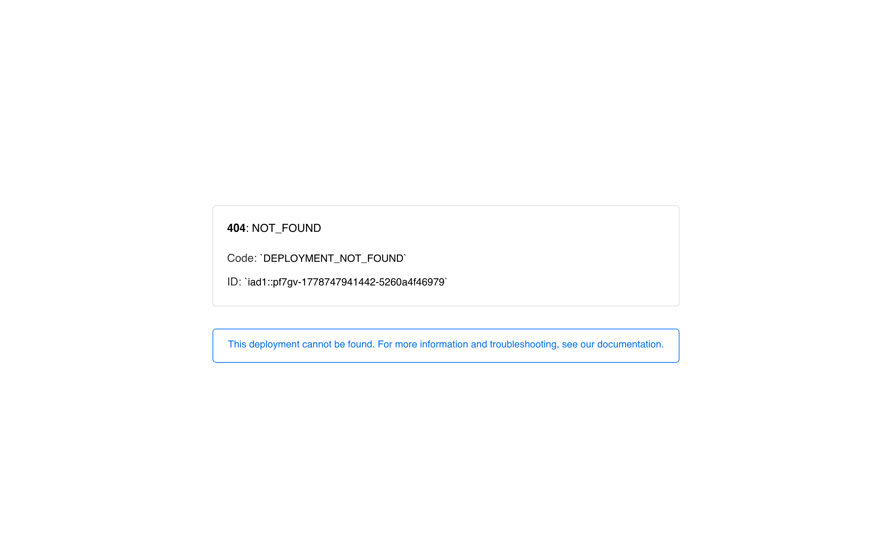
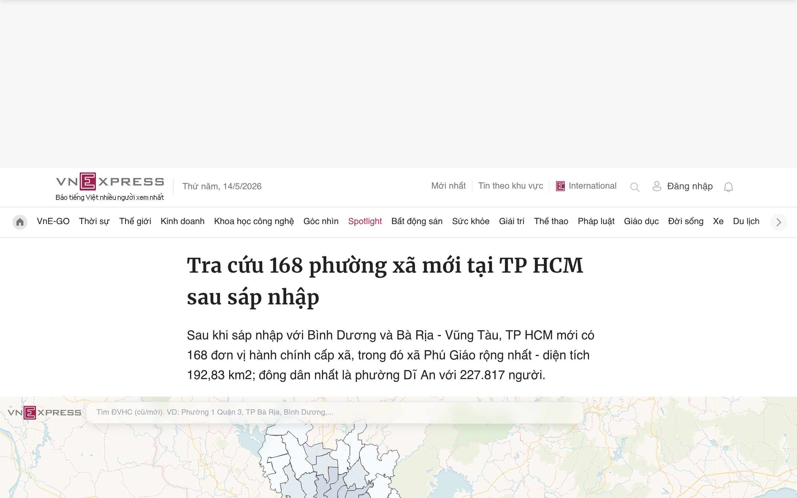
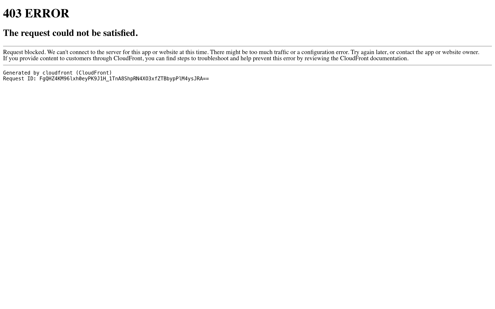
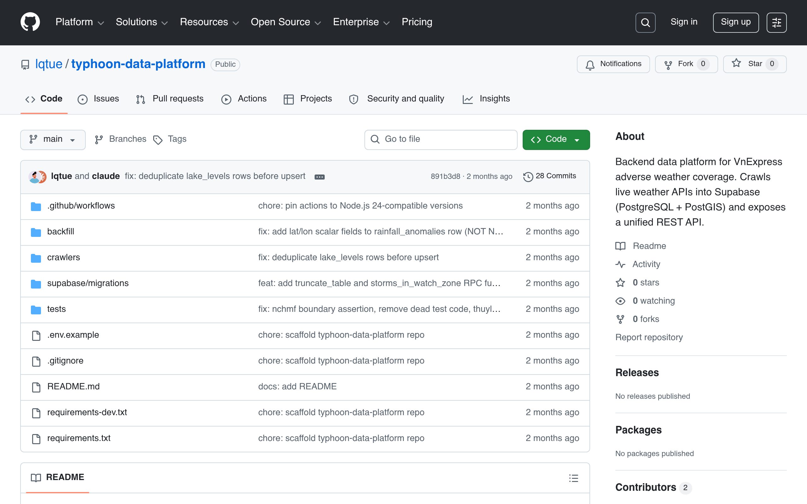
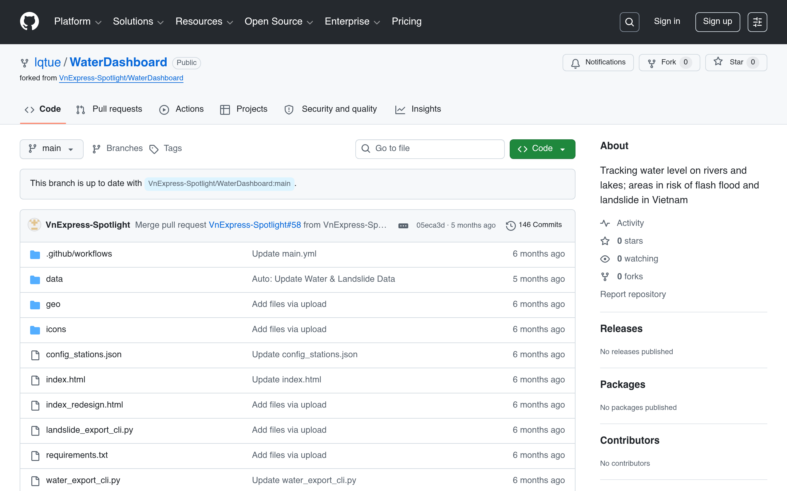

# Lê Quang Tuệ

**Data & Geospatial Storyteller · Open Source Advocate** · Ho Chi Minh City, Vietnam

I combine maps, data, and visualization to tell stories about the forces shaping Vietnam — from how political history left a "green debt" in its cities, to how a typhoon dismantled a mountainside. With experience at Zing News, VnExpress International, and VnExpress, I report on urban development, public policy, and environmental resilience. I also build open-source civic tools that make geographic and administrative data accessible to the public. I attended the Master of Public Policy program at Fulbright School of Public Policy and Management (FSPPM) and am applying for a PhD in Urban Planning.

[GitHub](https://github.com/lqtue) · [LinkedIn](https://vn.linkedin.com/in/lqtue) · [VnExpress](https://vnexpress.net) · [Download CV](https://github.com/lqtue/VWAI/blob/main/team/CV_Tue.docx.pdf)

**Jump to:** [Awards](#awards) · [Education](#education) · [Research](#research-interests) · [Publications](#publications) · [Projects](#projects) · [Journalism](#data-journalism) · [Skills](#skills) · [Press & Talks](#press--talks) · [Contact](#contact)

---

## Awards

::::{grid} 1 1 2 2
:::{card}
**Giải B — Sản Phẩm Báo Chí Ấn Tượng**

Hội Báo Toàn Quốc 2025

[Sài Gòn — Ngày 30/4](https://vnexpress.net/sai-gon-ngay-30-4-4876938.html) · Interactive multimedia retrospective on April 30, 1975 — the fall of Saigon — combining archival maps, audio, video testimony, and timeline narrative.

*With Đình Hoàng & Thành Hà · VnExpress*
:::

:::{card}
**Giải C — Giải Báo Chí Quốc Gia lần thứ XIX**

National Journalism Award 2024

[Trong mắt bão Yagi](https://vnexpress.net/trong-mat-bao-yagi-4795556.html) · Data-driven longform on Typhoon Yagi — Vietnam's strongest typhoon in 70 years — covering meteorological data, the Làng Nủ landslide, and infrastructure failures.

*VnExpress*
:::
::::

---

## Education

**Fulbright School of Public Policy and Management (FSPPM)** — Master of Public Policy
Completed coursework; thesis not submitted.

**University of Social Sciences and Humanities, Vietnam National University Ho Chi Minh City** — BA, International Relations

---

## Research Interests

How have successive planning regimes — French colonial, wartime, socialist, reform-era — encoded spatial inequality into Ho Chi Minh City's built form, and what constraints does this accumulated urban inheritance impose on contemporary climate-adaptive planning decisions? I approach this question through spatial-historical analysis, combining georeferenced historical cartography (via the Vietnam Map Archive) with archival research, land use statistics, and primary-source interviews with former planning officials. I am applying for PhD programs in Urban Planning to pursue this research full-time.

---

## Publications

::::{grid} 1
:::{card}
:link: https://doi.org/10.31223/X5NJ4B
**Urban Green Cover and Land Surface Temperature in Ho Chi Minh City: A Remote Sensing Analysis of Vegetation Cooling Effects Across Historical Development Rings, 1990–2025**

*Sole author · Pre-print · EarthArXiv · March 2026 · [doi:10.31223/X5NJ4B](https://doi.org/10.31223/X5NJ4B)*

Satellite imagery from 1990–2025 reveals that Ho Chi Minh City shed 130 km² of vegetation between 2000 and 2020, leaving 36 wards with critically low canopy coverage. Dense green areas are over 4°C cooler than concrete surfaces — demonstrating that the city's heat crisis reflects historical planning decisions, not just growth.
:::
::::

---

## Projects

### Urban Research & Civic Tools

::::{grid} 1 1 2 3
:::{card}
:link: https://svelte-beta-eight.vercel.app

**Vietnam Map Archive (VMA)**

Research infrastructure for the spatial history of Saigon — the first systematic georeferencing of French colonial and US Army cartographic sources for Ho Chi Minh City. Built as a SvelteKit 5 platform with a 6-layer data stack (georeferenced rasters → cadastral footprints → road networks → knowledge graph → community memory), crowdsourced annotation, AI-assisted vectorization (SAM2), and GPS-guided historical tours.

*OpenLayers · MapLibre GL · Supabase · PostGIS · Featured in Saigoneer & Hue Ngay Nay*
:::

:::{card}
:link: https://vnexpress.net/topic/50-nam-quy-hoach-tp-hcm-28042

**50 Years of Saigon Urban Planning**

Systematic analysis of five decades of planning decisions shaping Ho Chi Minh City — drawing on primary documentation, archival maps, and interviews with former officials including Deputy Chief Architect Võ Kim Cương. Covers the colonial grid, wartime expansion, socialist reconstruction, and Doi Moi market reforms.

*VnExpress · Longform series with interactive maps*
:::

:::{card}
:link: https://github.com/lqtue/phuongnao

**Phường Nào?**

Interactive lookup tool for Ho Chi Minh City's new administrative divisions following the 2025 merger. Search by name or GPS location — returns ward statistics, boundaries, and links to new offices.

*LeafletJS · Tailwind CSS · OpenStreetMap*
:::

:::{card}
:link: https://doi.org/10.31223/X5NJ4B

**Greenest Ward**

Satellite-based analysis of urban green space equity across Vietnam's 687 urban wards (1990–2025). Three-scale methodology: national ward measurements, HCMC accessibility analysis, and 35-year temporal tracking.

*Python · Sentinel-2 · NDVI · [EarthArXiv](https://doi.org/10.31223/X5NJ4B)*
:::
::::

### Environmental & Disaster Data

::::{grid} 1 1 2 3
:::{card}
:link: https://github.com/lqtue/typhoon-data-platform

**Typhoon Data Platform**

Backend data infrastructure powering VnExpress's adverse weather coverage. Crawls live weather APIs into Supabase (PostgreSQL + PostGIS) and exposes a unified REST API for real-time typhoon tracking.

*Python · PostGIS · REST API*
:::

:::{card}
:link: https://github.com/lqtue/WaterDashboard

**Water Dashboard**

Tracks water levels on rivers and lakes across Vietnam, flagging areas at risk of flash floods and landslides in near real-time.

*HTML · JavaScript*
:::

:::{card}
:link: https://github.com/lqtue/environmental-data-hub

**Environmental Data Hub**

Central index and documentation for all Spotlight environmental data projects — connecting datasets on air quality, flooding, typhoons, and land cover.
:::
::::

---

## Data Journalism

Selected works published at [VnExpress](https://vnexpress.net):

**Urban Planning & History**
- ★ [Sài Gòn — Ngày 30/4](https://vnexpress.net/sai-gon-ngay-30-4-4876938.html) — interactive multimedia retrospective on April 30, 1975 *(Giải B, Hội Báo Toàn Quốc 2025)*
- ↗ [50 Years of Saigon Urban Planning](https://vnexpress.net/topic/50-nam-quy-hoach-tp-hcm-28042) — see Projects above
- [Lookup: 168 New Wards in HCMC After the Merger](https://vnexpress.net/tra-cuu-168-phuong-xa-moi-tai-tp-hcm-sau-sap-nhap-4899275.html) — interactive tool and explainer
- [How New Ward Names Were Chosen](https://vnexpress.net/ten-phuong-xa-moi-duoc-dat-lai-the-nao-4918502.html) — policy and naming conventions behind Vietnam's administrative reform

**Extreme Weather & Disaster**
- ★ [Trong mắt bão Yagi](https://vnexpress.net/trong-mat-bao-yagi-4795556.html) — inside Vietnam's strongest typhoon in 70 years *(Giải C, Giải Báo Chí Quốc Gia XIX 2024)*
- [2025: A Year of Extreme Disasters](https://vnexpress.net/2025-nam-thien-tai-cuc-han-4999742.html)
- [Sleepless Nights in the Flood Zone — Hoa Thinh](https://vnexpress.net/dem-vo-vong-o-ron-lu-hoa-thinh-4947063.html)
- [Historic Flood Levels on Rivers in Dak Lak and Khanh Hoa](https://vnexpress.net/lu-song-o-dak-lak-khanh-hoa-vuot-muc-lich-su-4962647.html)
- [Why Flood Defense Layers in Thai Nguyen and Bac Ninh Could Not Hold](https://vnexpress.net/tai-sao-cac-lop-phong-thu-ngap-cua-thai-nguyen-bac-ninh-khong-the-cuu-nguy-4950247.html)
- [The Battle in Central Vietnam's Flood Corridors](https://vnexpress.net/cuoc-chien-can-nao-o-ron-lu-mien-trung-4960029.html)

**Air Quality & Environment**
- [How Many Cigarettes Do Hanoians "Smoke" Daily From Pollution?](https://vnexpress.net/nguoi-ha-noi-hut-thu-dong-bao-nhieu-dieu-thuoc-moi-ngay-do-o-nhiem-4988529.html)

---

## Skills

**Research & Analysis**
`Satellite imagery (Sentinel-2)` `NDVI / LST` `GIS & spatial analysis` `Data visualization` `Investigative journalism`

**Engineering**
`Python` `PostgreSQL / PostGIS` `SvelteKit` `OpenLayers` `MapLibre GL` `REST APIs` `Supabase` `GeoJSON`

**Languages**
`Vietnamese (native)` `English (professional)`

---

## Press & Talks

- **VTV24** — [Những nhà báo "đào sâu" tìm dữ liệu (Journalists Who Dig Deep for Data)](https://www.youtube.com/watch?v=aDHUrQCFXro)
- **Saigoneer** — ["An Indie Archival Project Dreams of Time Travel: How Lots and Lots of Vietnam Maps..."](https://saigoneer.com/vietnam-heritage/28674-an-indie-archival-project-dreams-of-time-travel-how-lots-and-lots-of-vietnam-maps)
- **Hue Ngay Nay** — [Số hóa bản đồ cổ (Digitizing Historical Maps)](https://huengaynay.vn/du-lich/so-hoa-ban-do-co-163431.html)
- **Presenter** — Engaging with Vietnam 20

---

## Contact

[GitHub](https://github.com/lqtue) · [LinkedIn](https://vn.linkedin.com/in/lqtue)
