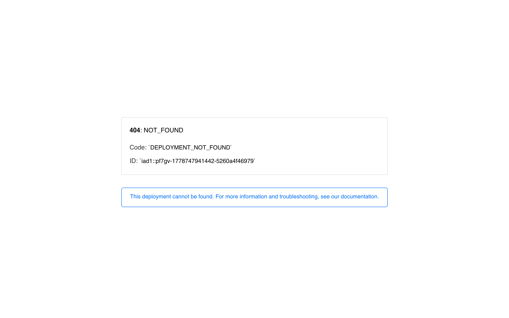
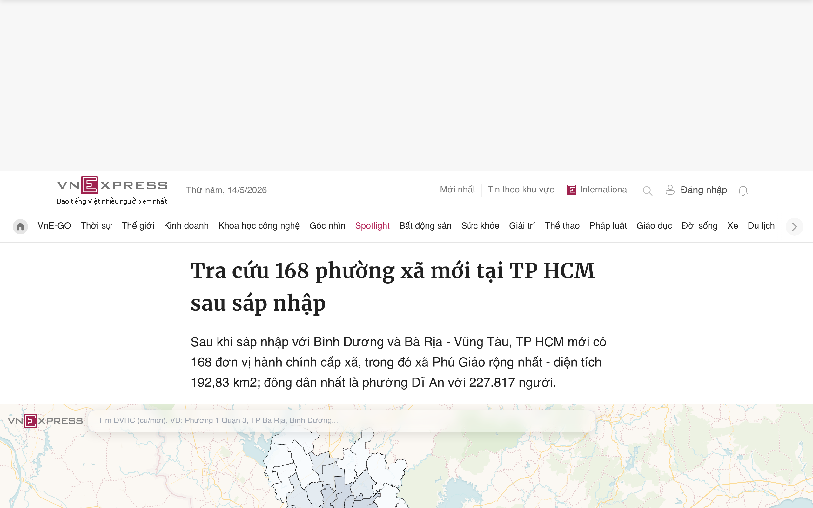
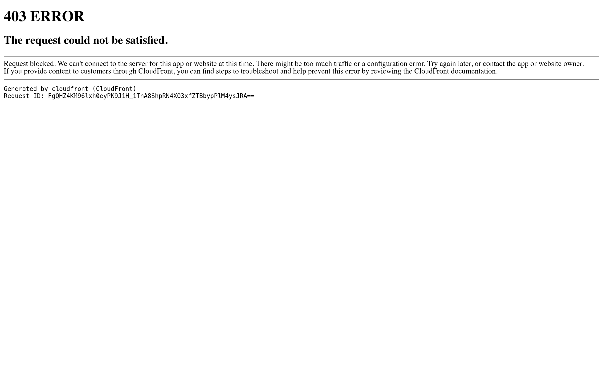
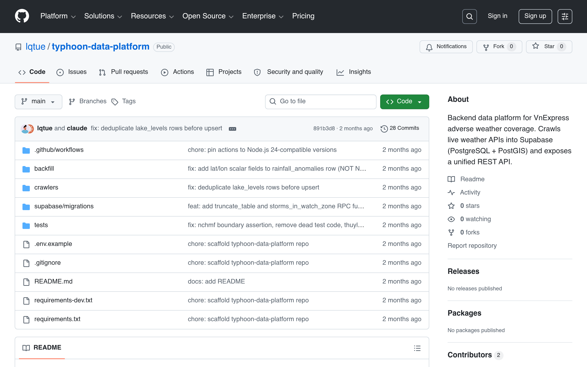
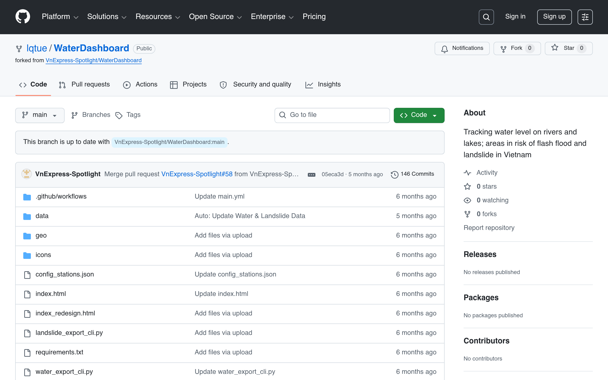

# Lê Quang Tuệ

**Geospatial Engineer · Data Journalist** · Ho Chi Minh City, Vietnam

I build geospatial data pipelines, and I write about what they find. That runs from national-scale building datasets and OpenStreetMap completeness measurement, to automated georeferencing of colonial and wartime cartography, to award-winning data journalism on typhoons, floods, and fifty years of urban planning in Ho Chi Minh City. Everything I build ends in something a non-specialist can read — a map, a lookup tool, a story.

Formerly data journalist at VnExpress (2024–2026), Zing News, and VnExpress International; in 2026, geospatial and AI specialist on Texas Tech University's Vietnam Wartime Accounting Initiative and map operations engineer at Tasco Maps. I attended the Master of Public Policy program at Fulbright School of Public Policy and Management (FSPPM) and am applying for a PhD in Urban Planning.

**Available for remote, deliverable-scoped work** in geospatial data, historical map digitisation, and map-quality measurement.

[GitHub](https://github.com/lqtue) · [LinkedIn](https://vn.linkedin.com/in/lqtue) · [VnExpress](https://vnexpress.net) · [CV](cv.md)

**Jump to:** [Awards](#awards) · [Experience](#experience) · [Education](#education) · [Research](#research-interests) · [Publications](#publications) · [Projects](#projects) · [Journalism](#data-journalism) · [Skills](#skills) · [Press & Talks](#press--talks) · [Contact](#contact)

---

## Awards

::::{grid} 1 1 2 2
:::{card}
**Giải B — Sản Phẩm Báo Chí Ấn Tượng**

Hội Báo Toàn Quốc 2025

[Sài Gòn — Ngày 30/4](https://vnexpress.net/sai-gon-ngay-30-4-4876938.html) · Interactive multimedia retrospective on April 30, 1975 — the fall of Saigon — combining archival maps, audio, video testimony, and timeline narrative.

*With Đình Hoàng & Thành Hà · VnExpress*
:::

:::{card}
**Giải C — Giải Báo Chí Quốc Gia lần thứ XIX**

National Journalism Award 2024

[Trong mắt bão Yagi](https://vnexpress.net/trong-mat-bao-yagi-4795556.html) · Data-driven longform on Typhoon Yagi — Vietnam's strongest typhoon in 70 years — covering meteorological data, the Làng Nủ landslide, and infrastructure failures.

*VnExpress*
:::
::::

---

## Experience

**Geospatial & AI/LLM Specialist** — Vietnam Wartime Accounting Initiative, Vietnam Center & Sam Johnson Vietnam Archive, *Texas Tech University* · 2026 · remote contract
Georeferencing of wartime maps; conversion of wartime grid and datum references (Indian 1960, UTM) to modern frameworks; AI-assisted extraction from degraded and handwritten archival documents for MIA case reconstruction. Technical lead of the team's AI/ML proposal covering a 2.7-million-page collection.

**Map Operations Engineer** — *VTII / Tasco Maps* · 2026
National building datasets for Vietnam in GeoParquet (Google Open Buildings, Global Building Atlas, Overture, Meta HRSL); a stratified height benchmark establishing what open global products can and cannot deliver for low-rise urban fabric; an H3-indexed OpenStreetMap completeness index of Hanoi with a Bayesian collection-tasking model; and the LOD1–LOD3 specification for a mobile 3D-buildings product.

**Data Journalist** — *VnExpress*, Spotlight Desk · 2024–2026
Built the data infrastructure behind the coverage as well as the graphics: a typhoon platform crawling NOAA/JTWC into PostGIS behind a REST API, hourly river and reservoir crawlers, and interactive maps and lookup tools. Credited as *Dữ liệu và Đồ họa: Quang Tuệ*.

**Media & Communications Officer** — *Fulbright Urban Social Economics (FUSE)* · 2024–
**Journalist** — *VnExpress International*, Business Desk · 2022 · **Journalist** — *Zing News*, World Desk · 2021

---

## Education

**Fulbright School of Public Policy and Management (FSPPM)** — Master of Public Policy
Completed coursework; thesis not submitted.

**University of Social Sciences and Humanities, Vietnam National University Ho Chi Minh City** — BA, International Relations

---

## Research Interests

How have successive planning regimes — French colonial, wartime, socialist, reform-era — encoded spatial inequality into Ho Chi Minh City's built form, and what constraints does this accumulated urban inheritance impose on contemporary climate-adaptive planning decisions? I approach this question through spatial-historical analysis, combining georeferenced historical cartography (via the Vietnam Map Archive) with archival research, land use statistics, and primary-source interviews with former planning officials. I am applying for PhD programs in Urban Planning to pursue this research full-time.

---

## Publications

::::{grid} 1
:::{card}
:link: https://doi.org/10.31223/X5NJ4B
**Urban Green Cover and Land Surface Temperature in Ho Chi Minh City: A Remote Sensing Analysis of Vegetation Cooling Effects Across Historical Development Rings, 1990–2025**

*Sole author · Pre-print · EarthArXiv · March 2026 · [doi:10.31223/X5NJ4B](https://doi.org/10.31223/X5NJ4B)*

Satellite imagery from 1990–2025 reveals that Ho Chi Minh City shed 130 km² of vegetation between 2000 and 2020, leaving 36 wards with critically low canopy coverage. Dense green areas are over 4°C cooler than concrete surfaces — demonstrating that the city's heat crisis reflects historical planning decisions, not just growth.
:::
::::

---

## Projects

### Urban Research & Civic Tools

::::{grid} 1 1 2 3
:::{card}
:link: https://maparchive.vn

**Vietnam Map Archive (VMA)**

Research infrastructure for the spatial history of Saigon — the first systematic georeferencing of French colonial and US Army cartographic sources for Ho Chi Minh City. Built and operated solo: 101 maps catalogued, 39 georeferenced, a 394-name historical gazetteer, IIIF hosting with Internet Archive redundancy, toponym extraction by LLM with a human review interface, SAM2 building segmentation, and GPS-guided historical tours. The US Army L7014 series (535 sheets, 1:50,000) is georeferenced automatically, including an Indian 1960 → WGS 84 datum correction.

*SvelteKit · OpenLayers · Allmaps · IIIF · PostGIS · PMTiles · Featured in Saigoneer, Huế Ngày Nay & VTV24*
:::

:::{card}
:link: https://vnexpress.net/topic/50-nam-quy-hoach-tp-hcm-28042

**50 Years of Saigon Urban Planning**

Systematic analysis of five decades of planning decisions shaping Ho Chi Minh City — drawing on primary documentation, archival maps, and interviews with former officials including Deputy Chief Architect Võ Kim Cương. Covers the colonial grid, wartime expansion, socialist reconstruction, and Doi Moi market reforms.

*VnExpress · Longform series with interactive maps*
:::

:::{card}
:link: https://github.com/lqtue/phuongnao

**Phường Nào?**

Interactive lookup tool for Ho Chi Minh City's new administrative divisions following the 2025 merger. Search by name or GPS location — returns ward statistics, boundaries, and links to new offices.

*LeafletJS · Tailwind CSS · OpenStreetMap*
:::

:::{card}
:link: https://www.linkedin.com/in/lqtue/recent-activity/all/
**2025 Vietnam Administrative Dataset**

Open boundary dataset for Vietnam's post-merger administrative geography, built and released when no authoritative open version existed. Picked up and redistributed across the Vietnamese geospatial community, and the base layer under the ward-lookup tool and the newsroom's merger coverage.

*QGIS · GeoJSON / GeoPackage · open release*
:::

:::{card}
:link: https://www.linkedin.com/in/lqtue/recent-activity/all/
**Vietnam's Map Merging Mishap**

A technical audit of the government's new official administrative map, published openly: the service was unrestricted and unsecured, and its geometry put islands on the mainland. Written up as a deep dive rather than a complaint — what was wrong, how it was found, and what it means for anyone building on the data.

*Data audit · web services · public write-up*
:::

:::{card}
:link: https://github.com/lqtue/HACW
**Hội An Creative Week**

Mobile-first festival PWA: 25 destinations, two-tier GPS and quiz check-in, an on-device stamp passport with points and rank tiers, themed walking tours, and an organizer dashboard that rebalances crowds across sites. Works fully offline; check-in analytics land in Cloudflare D1 instead of a third-party tracker.

*SvelteKit · Cloudflare Pages + D1 · service worker*
:::

:::{card}
:link: https://github.com/spotlightvne
**Newsroom data tools (Spotlight)**

The shared data stack behind VnExpress's environment and disaster coverage: hourly crawlers for 16 river stations and 22 reservoirs, commune-level landslide and flash-flood risk maps for Huế and Đà Nẵng, ward-level PM2.5 for Hanoi, flood-extent mapping from satellite imagery, and costing tools for policy stories.

*Python · GitHub Actions · deck.gl · Supabase*
:::

:::{card}
:link: https://doi.org/10.31223/X5NJ4B

**Greenest Ward**

Satellite-based analysis of urban green space equity across Vietnam's 687 urban wards (1990–2025). Three-scale methodology: national ward measurements, HCMC accessibility analysis, and 35-year temporal tracking.

*Python · Sentinel-2 · NDVI · [EarthArXiv](https://doi.org/10.31223/X5NJ4B)*
:::
::::

### Environmental & Disaster Data

::::{grid} 1 1 2 3
:::{card}
:link: https://github.com/lqtue/typhoon-data-platform

**Typhoon Data Platform**

Backend data infrastructure powering VnExpress's adverse weather coverage. Crawls live weather APIs into Supabase (PostgreSQL + PostGIS) and exposes a unified REST API for real-time typhoon tracking.

*Python · PostGIS · REST API*
:::

:::{card}
:link: https://github.com/lqtue/WaterDashboard

**Water Dashboard**

Tracks water levels on rivers and lakes across Vietnam, flagging areas at risk of flash floods and landslides in near real-time.

*HTML · JavaScript*
:::

:::{card}
:link: https://github.com/lqtue/environmental-data-hub

**Environmental Data Hub**

Central index and documentation for all Spotlight environmental data projects — connecting datasets on air quality, flooding, typhoons, and land cover.
:::
::::

---

## Data Journalism

Bylined as **Quang Tuệ** at [VnExpress](https://vnexpress.net), 2024–2026. Twenty-two published pieces; selected below.

**Urban Planning, History & Administrative Reform**
- [Cuộc tái thiết giao thông TP HCM sau thống nhất](https://vnexpress.net/cuoc-tai-thiet-giao-thong-tp-hcm-sau-thong-nhat-4874813.html) — 2025-04-17
- [Cuộc tái thiết đô thị Sài Gòn sau chiến tranh](https://vnexpress.net/cuoc-tai-thiet-do-thi-sai-gon-sau-chien-tranh-4876771.html) — 2025-04-22
- [Giấc mơ hướng biển và tương lai đô thị TP HCM sau sáp nhập](https://vnexpress.net/giac-mo-huong-bien-va-tuong-lai-do-thi-tp-hcm-sau-sap-nhap-4878252.html) — 2025-04-25
- [Hình hài Sài Gòn - TP HCM thay đổi thế nào sau 50 năm](https://vnexpress.net/hinh-hai-sai-gon-tp-hcm-thay-doi-the-nao-sau-50-nam-4878274.html) — 2025-04-26
- [Sài Gòn - Ngày 30/4](https://vnexpress.net/sai-gon-ngay-30-4-4876938.html) — 2025-04-29 · ★ *Giải B, Hội Báo Toàn Quốc 2025*
- [Việt Nam thay đổi thế nào sau sáp nhập tỉnh, thành](https://vnexpress.net/viet-nam-thay-doi-the-nao-sau-sap-nhap-tinh-thanh-4885968.html) — 2025-06-12
- [Tra cứu 168 phường xã mới tại TP HCM sau sáp nhập](https://vnexpress.net/tra-cuu-168-phuong-xa-moi-tai-tp-hcm-sau-sap-nhap-4899275.html) — 2025-06-28
- [Tương lai 'siêu đô thị' TP HCM](https://vnexpress.net/tuong-lai-sieu-do-thi-tp-hcm-4906730.html) — 2025-07-01
- [Tên phường xã mới được đặt lại thế nào](https://vnexpress.net/ten-phuong-xa-moi-duoc-dat-lai-the-nao-4918502.html) — 2025-08-01

**Extreme Weather & Disaster**
- [Yagi - cơn bão tăng cấp bất thường](https://vnexpress.net/yagi-con-bao-tang-cap-bat-thuong-4789948.html) — 2024-09-07
- [Cảnh báo 'tím' lan rộng các tỉnh phía Bắc sau bão Yagi](https://vnexpress.net/canh-bao-tim-lan-rong-cac-tinh-phia-bac-sau-bao-yagi-4790448.html) — 2024-09-09
- [Vì sao Lào Cai, Cao Bằng, Yên Bái hứng chịu sạt lở, lũ quét?](https://vnexpress.net/vi-sao-lao-cai-cao-bang-yen-bai-hung-chiu-sat-lo-lu-quet-4793081.html) — 2024-09-17
- [Trong mắt bão Yagi](https://vnexpress.net/trong-mat-bao-yagi-4795556.html) — 2024-09-24 · ★ *Giải C, Giải Báo chí Quốc gia XIX*
- [Tại sao các lớp phòng thủ ngập của Thái Nguyên, Bắc Ninh không thể 'cứu nguy'](https://vnexpress.net/tai-sao-cac-lop-phong-thu-ngap-cua-thai-nguyen-bac-ninh-khong-the-cuu-nguy-4950247.html) — 2025-10-12
- [Cuộc chiến cân não ở 'rốn lũ' miền Trung](https://vnexpress.net/cuoc-chien-can-nao-o-ron-lu-mien-trung-4960029.html) — 2025-11-05
- [Kalmaegi là bão mạnh nhất đổ bộ Quảng Ngãi - Gia Lai 5 năm qua](https://vnexpress.net/kalmaegi-la-bao-manh-nhat-do-bo-quang-ngai-gia-lai-5-nam-qua-4960531.html) — 2025-11-06
- [Lũ sông ở Đăk Lăk, Khánh Hoà vượt mức lịch sử](https://vnexpress.net/lu-song-o-dak-lak-khanh-hoa-vuot-muc-lich-su-4962647.html) — 2025-11-19
- [Tại sao Hòa Thịnh, Đông Hòa thành rốn lũ?](https://vnexpress.net/tai-sao-hoa-thinh-dong-hoa-thanh-ron-lu-4976051.html) — 2025-11-23 · flood extent from 3 m SAR imagery
- [Đêm vô vọng ở rốn lũ Hòa Thịnh](https://vnexpress.net/dem-vo-vong-o-ron-lu-hoa-thinh-4947063.html) — 2025-11-26
- [2025 - Năm thiên tai cực hạn](https://vnexpress.net/2025-nam-thien-tai-cuc-han-4999742.html) — 2025-12-30

**Economy, Education & Environment**
- [Người Việt đầu tư học tiếng Anh thế nào](https://vnexpress.net/nguoi-viet-dau-tu-hoc-tieng-anh-the-nao-4796385.html) — 2025-01-02
- [Người Hà Nội 'hút' thụ động bao nhiêu điếu thuốc mỗi ngày do ô nhiễm?](https://vnexpress.net/nguoi-ha-noi-hut-thu-dong-bao-nhieu-dieu-thuoc-moi-ngay-do-o-nhiem-4988529.html) — 2025-12-02

---

## Skills

**Geospatial**
`Georeferencing & GCP propagation` `IIIF` `Allmaps` `GDAL / PROJ` `Datum & grid conversion (Indian 1960, VN2000, UTM)` `H3` `GeoParquet` `PMTiles` `OpenStreetMap` `QGIS` `CityJSON / 3D Tiles`

**Research & Analysis**
`Satellite imagery (Sentinel-2)` `NDVI / LST` `Bayesian estimation` `Map-quality & completeness measurement` `Data visualization` `Investigative journalism`

**Engineering**
`Python (geopandas, rasterio, GDAL)` `PostgreSQL / PostGIS` `SvelteKit` `TypeScript` `OpenLayers` `MapLibre GL` `Supabase` `Cloudflare Pages / R2 / D1` `Playwright`

**AI in production**
`Schema-constrained LLM extraction` `Document & map OCR pipelines` `SAM2 / LoRA fine-tuning` `Human-in-the-loop review design`

**Languages**
`Vietnamese (native)` `English (professional)`

---

## Press & Talks

- **VTV24** — [Những nhà báo "đào sâu" tìm dữ liệu (Journalists Who Dig Deep for Data)](https://www.youtube.com/watch?v=aDHUrQCFXro)
- **Saigoneer** — ["An Indie Archival Project Dreams of Time Travel: How Lots and Lots of Vietnam Maps..."](https://saigoneer.com/vietnam-heritage/28674-an-indie-archival-project-dreams-of-time-travel-how-lots-and-lots-of-vietnam-maps)
- **Hue Ngay Nay** — [Số hóa bản đồ cổ (Digitizing Historical Maps)](https://huengaynay.vn/du-lich/so-hoa-ban-do-co-163431.html)
- **[Geospatial FM](https://www.geospatial.fm/)** — guest episode with Wilfred Waters GISP on mapping Vietnam's administrative remapping (2025)
- **Presenter** — Engaging with Vietnam 20

---

## Contact

[GitHub](https://github.com/lqtue) · [LinkedIn](https://vn.linkedin.com/in/lqtue)
